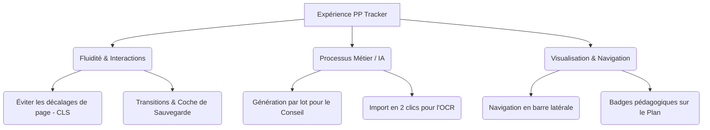

# 🎨 Plan d'Amélioration UX/UI — PP Tracker

Ce document rassemble des recommandations ergonomiques et fonctionnelles pour faire passer **PP Tracker** d'un prototype avancé à une application fluide, intuitive et digne des standards professionnels de design d'interface.

---

## 📌 Synthèse des Axes Prioritaires

---

## 1. Architecture & Navigation Globale (`App.jsx`)

### 🔍 Situation Actuelle
La barre de navigation supérieure comporte 9 onglets horizontaux. Cette disposition souffre d'un manque de hiérarchie (les paramètres de l'application sont sur le même plan que la liste des élèves) et présente des risques importants d'affichage dégradé (wrapping ou scroll horizontal) sur les petits écrans d'ordinateurs portables.

### 💡 Recommandations UX
1. **Transition vers une Barre Latérale (Sidebar)** : 
   - Remplacer le header horizontal par un menu vertical à gauche. C'est le standard pour les logiciels de type "Tableau de bord" à haute densité d'informations.
2. **Regroupement Logique & Catégorisation** :
   - **Suivi Actif** : Liste (`/`), Tableau de bord (`/dashboard`), Plan de classe (`/plan-classe`).
   - **Outils & Périodes** : Conseil (`/conseil`), OCR Bulletins (`/ocr`), Orientation (`/orientation`), Rapport (`/rapport`).
   - **Configuration** : Paramètres (`/settings`).
3. **Minimiser le Menu (Collapsible Sidebar)** :
   - Permettre de réduire la barre latérale sous forme d'icônes simples pour maximiser l'espace de travail principal.

---

## 2. Stabilité Ergonomique de la Fiche Élève (`FicheElevePage.jsx`)

### 🔍 Situation Actuelle
Les formulaires pour ajouter un contact avec la famille, enregistrer une absence ou ajouter un document d'accompagnement (M9) s'ouvrent en accordéon directement au milieu du contenu. Cela crée des variations brusques de hauteur de page (Layout Shifts), perturbant l'attention visuelle de l'enseignant.

### 💡 Recommandations UX
1. **Panneaux Latéraux Coulissants (Drawers)** :
   - Au lieu d'ouvrir les formulaires dans la page, faites-les glisser depuis le bord droit de l'écran avec une ombre douce en arrière-plan.
   - Cette méthode isole l'action d'écriture sans faire bouger les graphes ou les tableaux de la fiche élève.
2. **Transitions de Sauvegarde Transparentes** :
   - Actuellement, modifier une certification ou un parcours éducatif déclenche une sauvegarde automatique discrète (`Saving...`). 
   - **UX Tip** : Utiliser un indicateur sous forme de petit badge vert fugace `✓ Modifié` ou changer brièvement la couleur de fond de la carte modifiée pour confirmer visuellement l'écriture physique en base SQLite.
3. **Persistance de l'Onglet Actif** :
   - Mémoriser dans l'état local ou le `sessionStorage` quel onglet du bloc Profil & Parcours était actif (`certifications`, `parcours` ou `documents`) afin qu'il ne se réinitialise pas si l'enseignant quitte temporairement la fiche élève.

---

## 3. Optimisation du Module Conseil de Classe (`ConseilPage.jsx`)

### 🔍 Situation Actuelle
L'intégration de l'IA locale (Ollama) est une excellente brique innovante. Cependant, la génération individuelle des appréciations (une par une, avec l'attente liée à la vitesse d'inférence de la machine) est très chronophage sur une classe entière de 30 élèves.

### 💡 Recommandations UX
1. **Bouton de Génération par Lot (Bulk Processing)** :
   - Ajouter un bouton principal en haut de la page : `"Générer toutes les appréciations (IA)"`.
   - L'application boucle de manière asynchrone sur les élèves n'ayant pas encore d'appréciation écrite, affichant un spinner discret sur chaque carte pendant que l'enseignant continue à relire et corriger les autres.
2. **Curseur de "Température" / Variateur de Ton** :
   - Permettre à l'enseignant d'orienter le style de l'IA avant génération via un mini-sélecteur :
     - 📢 *Factuel & Direct*
     - 🎓 *Exigeant & Stimulant*
     - 🌸 *Encourageant & Bienveillant*
     - 📝 *Court & Synthétique*

---

## 4. Finalisation du Flux de l'OCR Bulletins (`OcrPage.jsx`)

### 🔍 Situation Actuelle
La page de dépôt avec retour d'état de chargement via Qwen2.5VL est impeccable. Cependant, les résultats extraits constituent un "cul-de-sac UX" : l'enseignant voit les notes et appréciations extraites à l'écran, mais ne peut rien en faire directement à part copier-coller manuellement.

### 💡 Recommandations UX
1. **Bouton d'Importation Directe (Clôture du flux)** :
   - **Étape A** : Ajouter un sélecteur d'élève au-dessus du résultat extrait : *"À quel élève appartient ce bulletin ?"* (avec suggestion automatique basée sur le prénom/nom extrait par l'OCR).
   - **Étape B** : Ajouter un bouton d'importation globale : `"✓ Valider et Importer dans la Fiche Élève"`.
   - **Résultat** : Un gain de temps massif pour l'enseignant et une vraie sensation de fluidité technologique.

---

## 5. Intelligence Spatiale du Plan de Classe (`PlanClassePage.jsx`)

### 🔍 Situation Actuelle
La grille virtuelle par glisser-déposer fonctionne bien. Mais le placement initial d'une classe complète de 30 élèves un à un peut sembler rébarbatif. De plus, une fois placés, aucune information clé n'émerge des sièges.

### 💡 Recommandations UX
1. **Algorithmes de Placement Automatique Rapide** :
   - Ajouter un bouton d'action rapide pour pré-remplir la grille en un clic :
     - 🔠 *Placer par ordre alphabétique* (nominal)
     - 🎲 *Placer de manière aléatoire* (idéal pour casser les binômes bavards en début d'année)
     - *L'enseignant n'a plus qu'à ajuster les détails à la main.*
2. **Visualisation Pédagogique Intelligente (Badges colorés)** :
   - Afficher un petit indicateur visuel discret sur les sièges des élèves concernés par un aménagement pédagogique (ex: point violet pour PAP, point vert pour ESS) ou en situation d'alerte (point rouge pour un score d'alerte > 75).
   - Cela permet à l'enseignant ou à un remplaçant de visualiser instantanément la topographie humaine et de s'assurer, par exemple, qu'un élève malvoyant ou dys est idéalement placé face au tableau.

---

## 6. UX de la Sécurité & Conformité Locale

Puisque l'argument clé du projet est son aspect **100% local et conforme au RGPD**, l'expérience utilisateur doit rassurer l'enseignant sur ce point.

### 💡 Recommandations UX
1. **Indicateur de Statut "Hors-Ligne / Local" permanent** :
   - Ajouter une petite icône de cadenas vert 🔒 en bas du menu ou de la barre latérale indiquant : `"Données chiffrées localement (Zéro Cloud)"`.
2. **Gestion intuitive des sauvegardes** :
   - Mettre en valeur visuellement le succès ou la date de la dernière sauvegarde automatique sur clé USB (configurée via le module M12).
